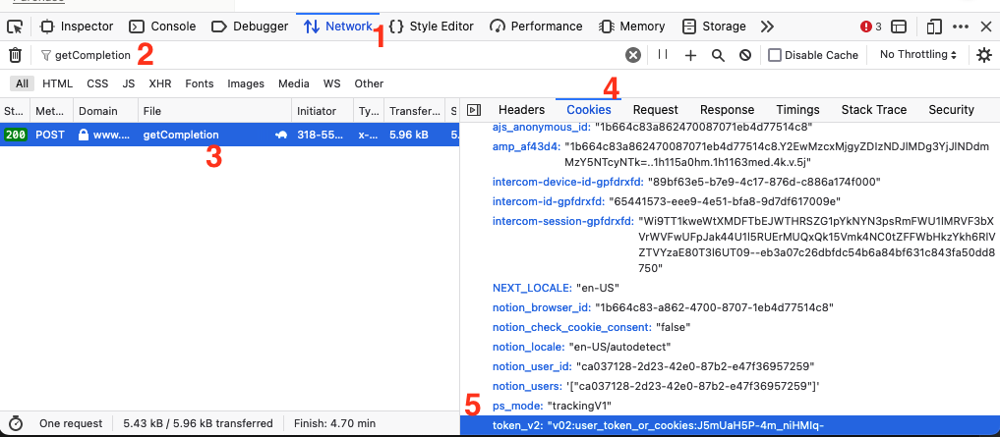
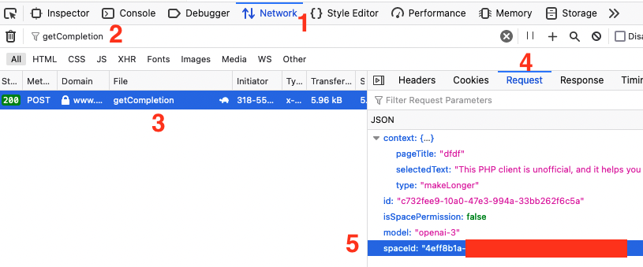

# Notion AI API Client for Python


## About this package

Notion AI is a strong artificial intelligence feature that uses GPT-3. It's found within the productivity app Notion. You can use Notion AI within Notion, but there isn't an official API available yet.

This Python client is unofficial, and it helps you use Notion AI in your Python projects.

## Setup

1. Get `token_v2` and `scpace_id` from your browser
2. Copy `.env.example` file to the `.env` file
3. Set `TOKEN_V2` and `SPACE_ID` variables in you `.env` files

## How to get token and space id from Notion?

1. Open inspector in your browser
2. Make any request to the Notion AI in the browser

3. Find and copy `token_v2`



4. Find and copy `spaceId`



## Usage

So far, only the `help_me_write` method is available. You can use it to generate text.

```
from notion_ai.client import notion_ai_client

prompt = "write a haiku poem about a dog in a space with dramatic tone of voice"
result = notion_ai_client.help_me_write(prompt)
```

## License

The MIT License. Please see [License File](LICENSE.md)